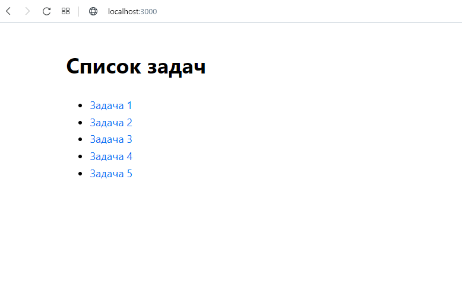
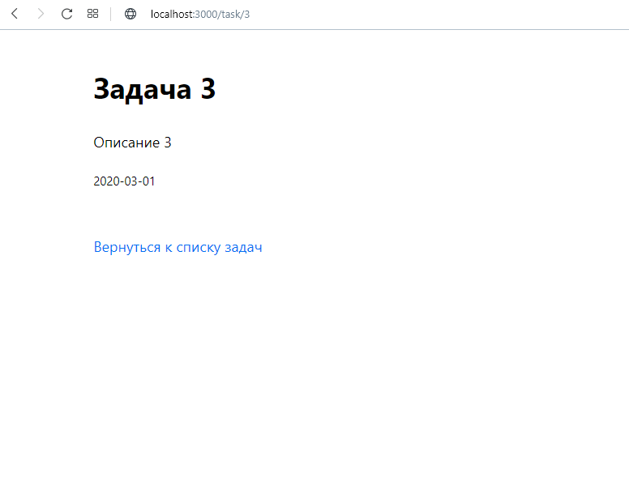

## Тестовое задание по Next.js

Задание для веб-разработчиков для участия в проекте для фонда «Не напрасно».

---

#### Клонировать проект, установить зависимости, запустить в режиме разработчика:

```sh
git clone https://github.com/SergeyDedikov/test__ne-naprasno.git
cd test__ne-naprasno
npm i
npm run dev
```

---



---


